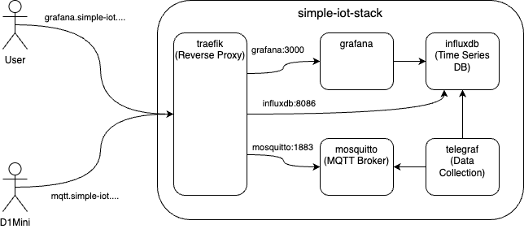

# Easy to use IoT Stack

This repository contains the documentation for an easy to use IoT stack.
The main goal is to provide an IoT stack that works out of the box,
without to much configuration effort. Furthermore, it should be possible
to deploy the stack both locally and on
virtual machines hosted at one of the hyper scalers.
[I](https://drumm.sh) created this repository for one of my lectures at the [FH Aachen](http://fh-aachen.de)

The IoT stack consists of the following components:

- [traefik](https://doc.traefik.io/traefik/) router
- [Mosquitto](https://mosquitto.org/) MQTT broker
- [InfluxDB](https://www.influxdata.com/) time series database
- [Telegraf](https://www.influxdata.com/time-series-platform/telegraf/) data collection agent
- [Grafana](https://grafana.com/)

The following figure shows how these components are connected:



If the IoT stack is deployed locally, services are accessible using the following
URL pattern: `<service-name>.localhost`.
For example, the InfluxDB can be accessed via `influxdb.localhost`. If the
IoT stack is deployed remotely one a virtual machine a dynamic DNS
(e.g. [DuckDNS](https://duckdns.org)) service is required. In this case the
services are accessible via the following URL pattern:
`<service-name>.<domain-name>`. For example, if the DNS `simple-iot.duckdns.org`
is used mapped to the IP of the virtual machine,
the InfluxDB can be accessed via `influxdb.simple-iot.duckdns.org`.

## Prerequisite

In order to use the stack some basic knowledge of using the shell is required. A
short introduction to using the shell can be found [here](https://ubuntu.com/tutorials/command-line-for-beginners).
On computers running Linux or MacOS, the default shell can be used. On Windows I
suggest install the [Windows Subsystem for Linux (WSL)](https://learn.microsoft.com/en-us/windows/wsl/install).

Furthermore, the following software needs to be installed:

- [Git](https://git-scm.com)
- [Docker](https://docs.docker.com/get-docker/)
- [Docker Compose](https://docs.docker.com/compose/install/)
- [OpenSSH](https://www.openssh.com/)
- [Visual Studio Code](https://code.visualstudio.com/) or a similar editor
- A [password manager](https://en.wikipedia.org/wiki/List_of_password_managers)

## Quickstart ⚡

To use this IoT stack you need to follow the steps below. It is very important
to change all the passwords before deploying the stack. To generate secure passwords
I recommend using a password manager like [Bitwarden](https://bitwarden.com).

### Preparation

1. Clone this repository using the command below.

   ```zsh
   git clone https://github.com/ceedee666/simple-iot.git
   ```

   The result should be a file structure similar to this:

   ```zsh
   simple-iot
   ├── README.md
   ├── docker-compose.yaml
   ├── entrypoint.sh
   ├── example_environment.txt
   ├── mosquitto
   │   └── mosquitto.conf
   └── telegraf
       └── telegraf.conf
   ```

1. Copy the file `example_evironment.txt` to `.env`. For example, by
   using the following command.

   ```zsh
   cp example_environment.txt .env
   ```

1. Edit the newly created file `.env` and replace all `-----> changeme <-----` values.
   Different steps are necessary to generate the values. These steps are shown below.

   1. The first step is to set the username (parameter `DOCKER_INFLUXDB_INIT_PASSWORD`)
      and password (parameter `DOCKER_INFLUXDB_INIT_USERNAME`) for the Influx database.
      A possible username is `admin`. A secure password can be generated using the
      a password manager. For example, using the command line interface of [Bitwarden](https://bitwarden.com)
      a secure password can be generated using the following command or in the
      UI of the password manager.

      ```zsh
      bw generate -p -c --words 5 --includeNumber
      ```

      After adding the username and password to the `environment.env` should look
      similar to the excerpt below.

      ```env
      # Primary InfluxDB admin/superuser credentials
      DOCKER_INFLUXDB_INIT_USERNAME=admin
      DOCKER_INFLUXDB_INIT_PASSWORD=dummy-123-...
      ```

   1. Next, the API token for the Influx database needs to be generated
      (parameter `DOCKER_INFLUXDB_INIT_ADMIN_TOKEN`). This can be done using the
      [OpenSSL](https://www.openssl.org/) command line interface.

      ```zsh
      openssl rand -hex 32
      ```

   1. The final step is to create the username and password for the
      Mosquitto MQTT broker.
      This username and password need to be added to the `environment.env` file.
      These values are used by [Telegraf](https://github.com/influxdata/telegraf)
      to authenticate with the broker.
      Additionally, the values need to be added to the `passwd` file in the
      `mosquitto` container.

      A possible username is `mosquitto`. A secure password can be generated using
      a password manager. The resulting lines in the `environment.env` should look
      similar to the excerpt below.

      ```env
      # Mosquitto username and password
      MOSQUITTO_USERNAME=mosquitto
      MOSQUITTO_PASSWORD=dummy-123-...
      ```

      To add the password for the user mosquitto to the `passwd` file use the
      following command:

      ```zsh
      docker-compose run --rm mosquitto mosquitto_passwd -c /mosquitto/config/passwd mosquitto mosquitto
      ```

      This command:

      1. Starts the mosquitto container and removes it after execution of the commond (`run --rm mosquitto`).
      2. Runs `mosquitto_passwd` to create the password file `/mosquitto/config/passwd_mossquitto` in the container.
      3. Adds the user `mosquitto` (the last occurrence of mosquitto in the command) to the password file and prompts
         for a password for this user.

### Starting the stack

After finishing the configuration is is now time to start the IoT stack.

```zsh
docker-compose up -d
```

This command causes a few things:

1. The required container images are downloaded
1. The volumes and the networks defined in the `docker-compose.yaml` are created
1. The services are started.

As the result a confirmation message similar to the following should be printed:

```zsh
 ✔ Container simple-iot-stack-influxdb-1   Started
 ✔ Container simple-iot-stack-mosquitto-1  Started
 ✔ Container simple-iot-stack-grafana-1    Started
 ✔ Container simple-iot-stack-telegraf-1   Started
 ✔ Container simple-iot-stack-traefik-1    Started
```

## Deployment on a Remote Virtual Machine

```zsh
chmod 400 <path-to-ssh-key>
ssh -i <path-to-ssh-key> ubuntu@<domain-name>
sudo apt-get update
sudo apt-get upgrade
sudo apt-get install docker docker-compose git neovim nano
```

## Acknowledgement

This repository is based on the following repositories, videos and documentation:

- [Telegraf, InfluxDB, Grafana (TIG) Stack](https://github.com/huntabyte/tig-stack)
- [Easy IoT data infrastructure setup via docker](https://github.com/Miceuz/docker-compose-mosquitto-influxdb-telegraf-grafana)
- [Easily Install InfluxDB, Telegraf, & Grafana with Docker](https://youtu.be/QGG_76OmRnA)
- [Running InfluxDB 2.0 and Telegraf Using Docker](https://www.influxdata.com/blog/running-influxdb-2-0-and-telegraf-using-docker/)
- [How to setup standalone mosquitto MQTT broker using docker-compose](https://techoverflow.net/2021/11/25/how-to-setup-standalone-mosquitto-mqtt-broker-using-docker-compose/)
- [Docker reverse proxy using Traefik](https://accesto.com/blog/docker-reverse-proxy-using-traefik/)
